# Infans · 小秘书

**一人公司的本地启动器。**

你负责提出目标。能交给 AI 的事会拆开、分类、自己往下转；必须你本人看过才算数的，会变成清楚的待办，等你验收。事情做到哪一步，写在你自己电脑上的文件里，换一个 AI、换一台设备，还能接着干。

不是又一个聊天框，也不是又一套待办软件。它要解决的是一人公司最常见的两件事：**启动成本太高，任务一切换就断。**

> 没有多大创新，也是用 AI 拼起来的。很多机制已经反复跑过，我自己每天在用。真正值钱的不是花样，而是做事终于能开始，中间被打断了也回得去。

> 大家觉得这些素材好的话，请务必支持 B 站动漫《凡人修仙传》！这比给我 star 还重要！

打开就能看到今天要做的、最近的行程、项目进行到哪，不用先翻五个软件。

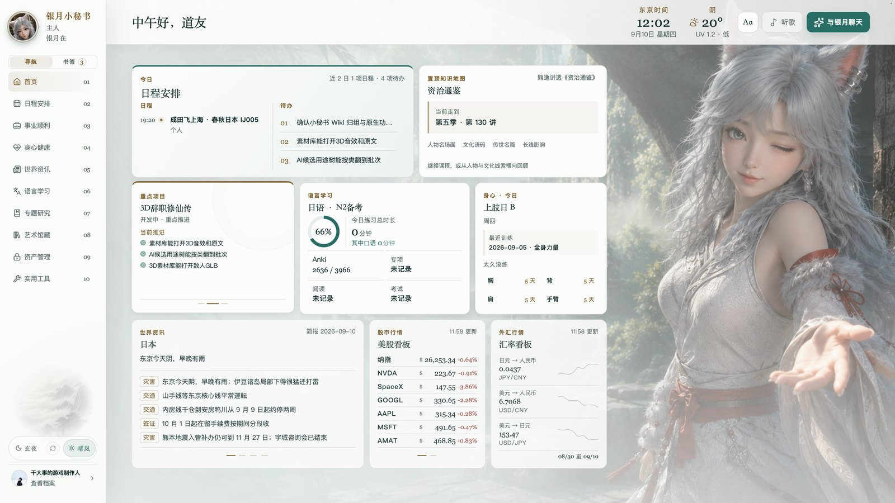

## 它在解决什么

一人做事，真正耗人的往往不是「会不会」，而是「怎么开始」和「怎么接上」。

资料要先找齐，心理还要铺垫一轮，才终于肯动手。上课、出门、换一件事，回来又得花很长时间回忆上次想到哪。注册账号、看一封看不懂的邮件、翻一张不知道丢在哪个文件夹里的图，每一件都不难，叠在一起就把一天磨没了。

AI 其实已经能做其中很大一块。缺的是一套能把目标、任务、进度、材料和设备串起来的工作台，让你不必每次重新组织战场。

Infans 就是这套工作台。它跑在你自己的电脑上，内容是你目录里的 Markdown 和 JSON。没有账号，不往云端传。规则写在仓库里，Cursor、Codex、ChatGPT 或其他 Agent 都能对着同一套说明接着干。

## 一天大概怎么转

1. **你说出目标。** 想开一件事、推进一个项目、处理一桩琐事，直接和秘书说，或写进项目页。
2. **系统帮你摊开。** 背景够、要求清楚时，它会拆成任务、分好类，给你一份能审的行动清单。
3. **能自动的自己转。** 授权过、资料齐、AI 做完可以核对的，会按规则往下跑，把结果写回原件。
4. **该你看的变成待办。** 观感、口径、要不要过这一关，只能你本人点头的，会清楚列出来。
5. **人可以离开工位。** Mac 继续干活。你用 iPhone、iPad 看阶段交付、投一张图、丢一条链接、说一句修正。

事情干到哪里、为什么这么做、下一步是什么，都留在库里。被打断之后，回来不必先花很大力气把自己重新带进那件事。

## 功能

### 今日事项

按四象限排今天的事，下面按项目列出全部在推的待办，轻重和归属一眼能分清。

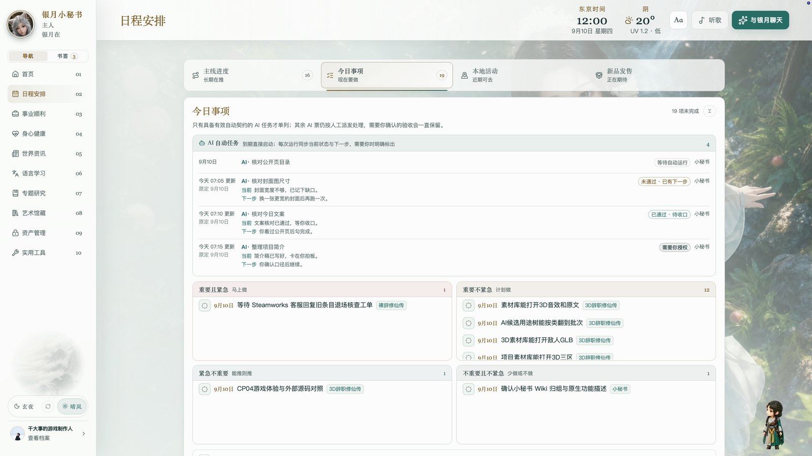

### 日程安排

生活、公司和学习摊在一条时间轴上，干到哪、下一步是什么，回来还能接上。

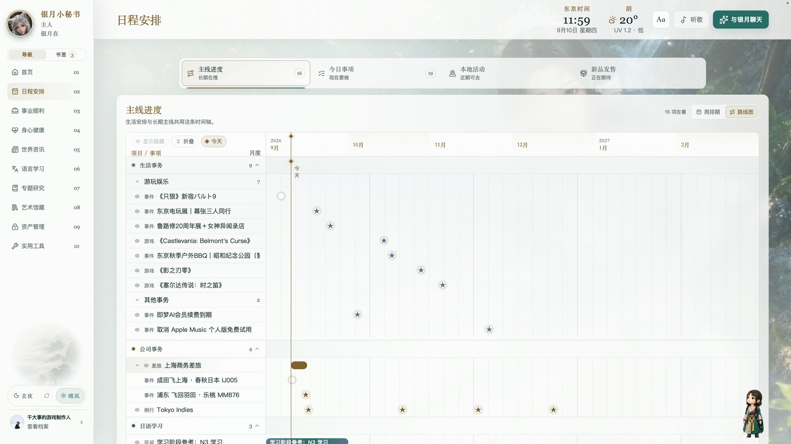

### 本地活动

近期能去的展、饭和活动收成攻略，出门前不用重新找一遍。


### 事业顺利

每个项目一张卡，当前状态、卡点和刚做成的事写在项目自己的文件里，看板只是入口。

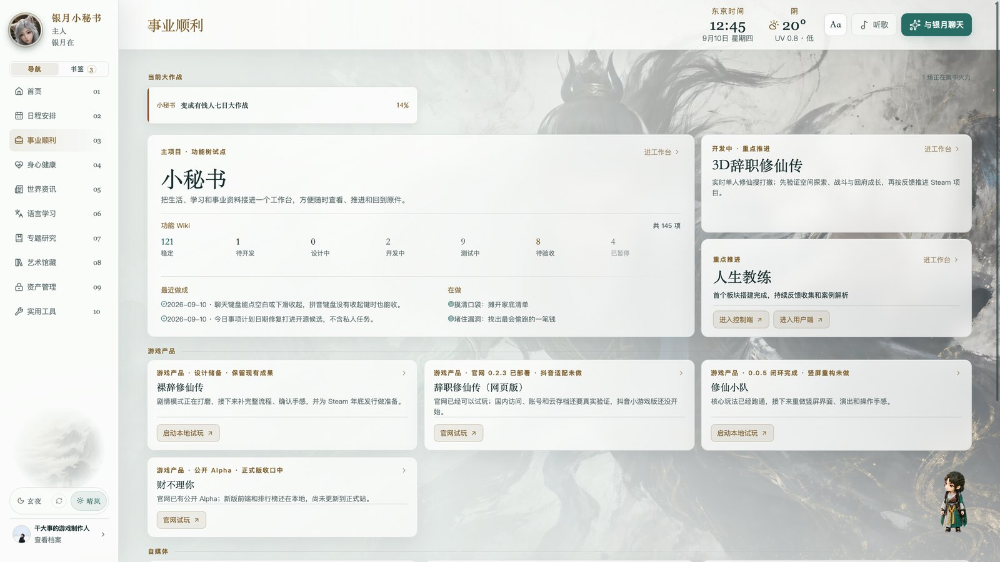

一段时间内必须打完的事，会单开一栏大作战，按天验收。

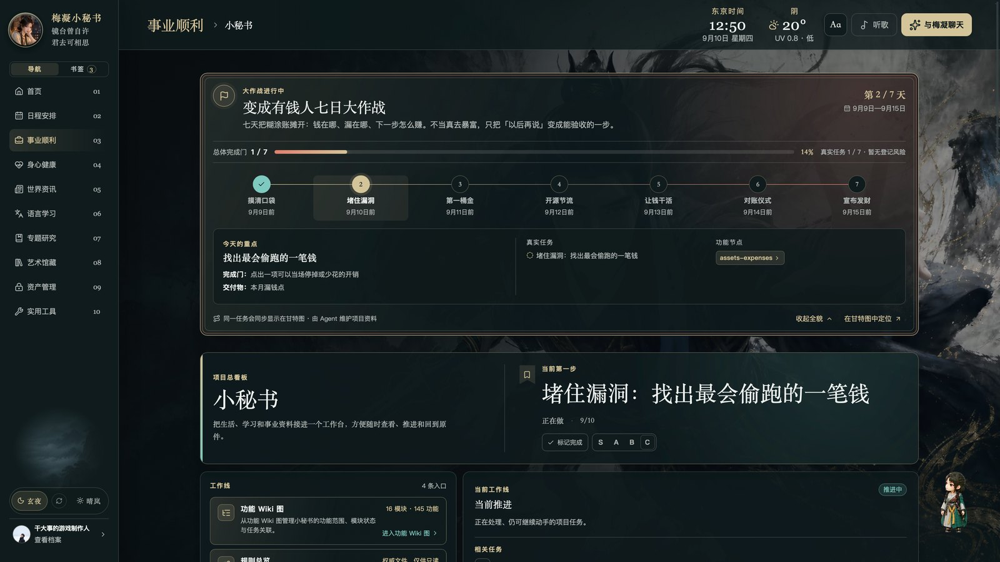

功能 Wiki 把能力摊成树，验收记录就写在对应节点上。

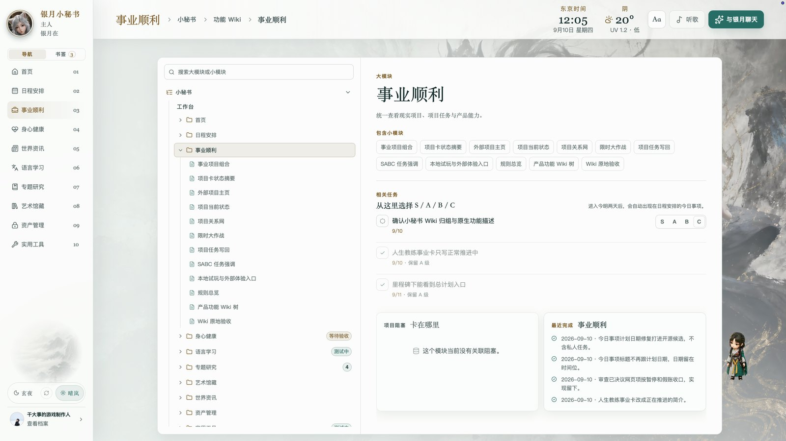

### 身心健康

训练、恢复、心理负荷和人生平衡放在同一页，身体的账也有地方记。


### 世界资讯

本地、金融、AI、游戏每天看一遍，看完就走；收藏和不喜欢只记在你本机。


### 专题研究

长期要啃的领域做成知识地图，先看见全貌，再点进真正关心的问题。

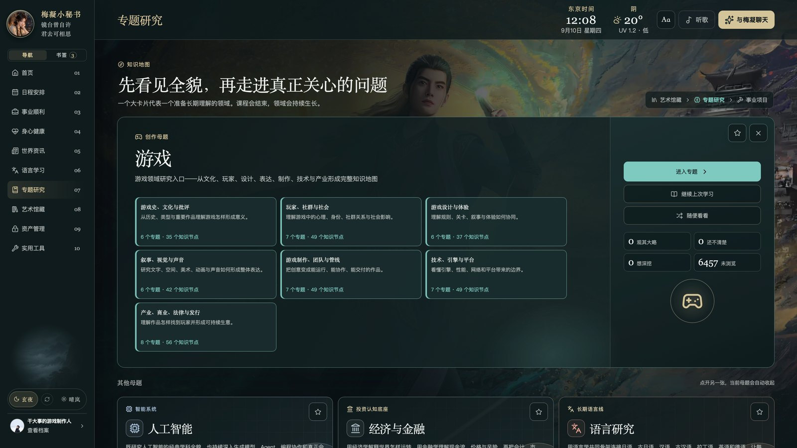

### 游戏典藏

玩过的游戏按库陈列，封面、时长和平台在一页里翻，不用再打开 Steam 对名单。

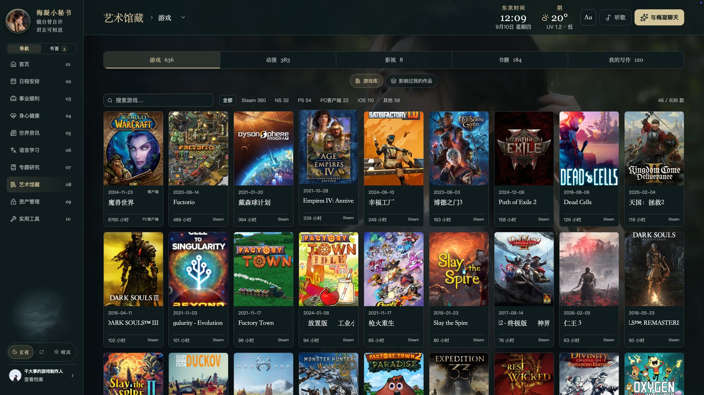

### 动漫典藏

看过和在追的动画按年份排开，进度和片单不用拆在三个网站里。

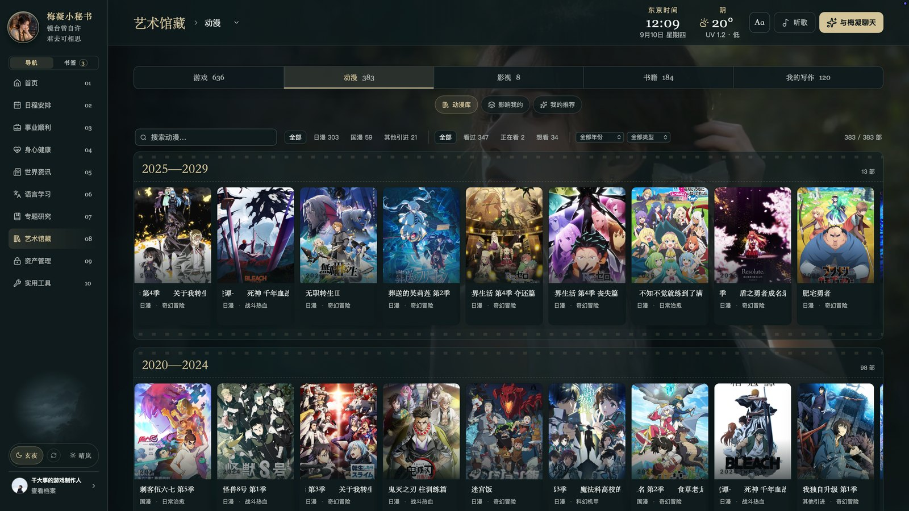

### 资产管理

资产、投资、收入、支出收成全景，账在自己的文件里。


### 实用工具

秘书、工作、生活常用的入口放在同一张启动台，少开十个 App。

### 秘书收件箱

手机或浏览器随手发给秘书的图和链接，在这里接住。iPad 上可以一边看收件，一边看 Codex 还在干活；人已经离开工位，也能投料、看它交没交得出来。

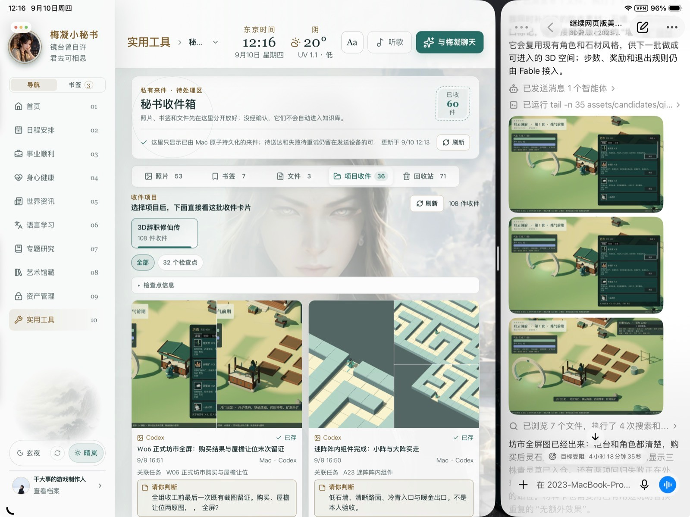

### 异常雷达

定时任务有没有跑成、电脑是不是在白忙，出问题先看这里。

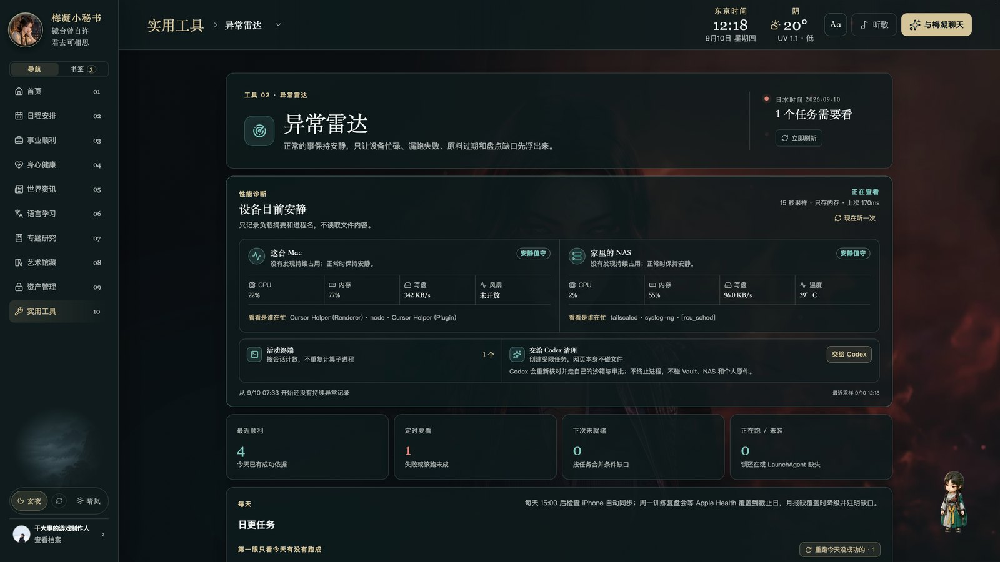

### Token 管理

每个任务花了多少 Token、花在哪个项目上，用量不再是一笔糊涂账。

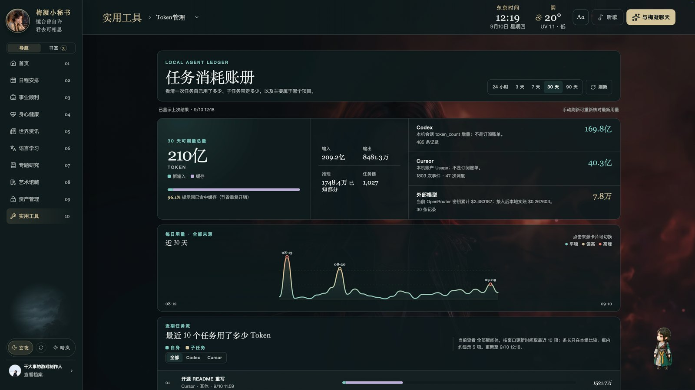

### 系统设置

主题、字号、快捷键和值班秘书，把工作台调成自己顺手的样子。

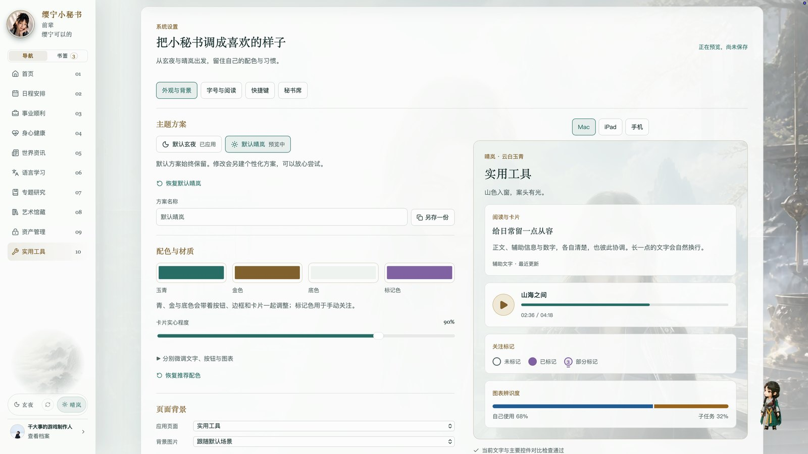

### 项目素材库

素材按用途排，正式、候选、归档分开。大图就在工作台里看，手机和平板打开同一页也能读，不必在层层文件夹里翻。


### 多设备

Mac 是工位，平板是手和眼：同一套待办和进度，出门也能看、也能说话。


## 快速开始

需要 Node.js 22，以及 lockfile 对应版本的 pnpm。首次搭建时，作者更推荐用 **GPT 6 mini** 对照仓库根 `AGENTS.md` 和 `docs/quickstart.md` 往下做。

```bash
cd Infans_Studio/00_本地工作台/app
pnpm install --frozen-lockfile
pnpm init:data          # 已有数据根则改用 pnpm bind:data
pnpm build
bash scripts/start-local.sh
```

浏览器打开 `http://127.0.0.1:5173`。

不要把仓库本身当数据根。聊天、缓存、运行记录都应该落在源码之外。已经有库就用 `pnpm bind:data`，它只写指针，不动你的文件。

更细的说明在 `docs/`：`quickstart.md`（上手）、`capabilities.md`（每项到什么程度）、`ios-build.md`、`macos-build.md`、`self-hosting.md`、`backup-and-restore.md`。

技术上：前端 React 19 + TypeScript + Vite，后端 Node 22 本地服务，没有数据库。桌面壳和手机端是 Swift。服务默认只听本机。读文件走白名单，写文件先预览再落盘。

## 隐私

服务只听回环地址，读写都在你指定的目录里，没有账号，没有遥测。凭据不要写进仓库。

## 许可

代码按 MIT 发布，见 `LICENSE`。内置霞鹜文楷按 SIL OFL 1.1，随附 OFL 与 NOTICE。
